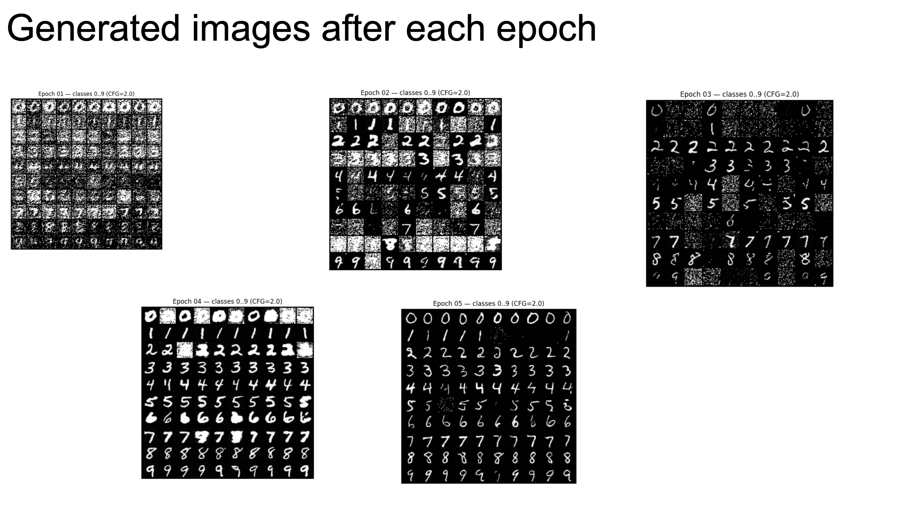

# Diffusion Models from Scratch: MNIST Generation

Custom implementation of a class-conditional diffusion model for generating MNIST digits from noise.

## Quick Start

```bash
pip install torch torchvision matplotlib numpy
python diffusion_model.py
```

## Key Results

**Training Progress**: Model learned to generate recognizable digits over 5 epochs
- **Epoch 1**: Noisy blobs → **Epoch 5**: Clear, readable digits
- **Class Conditioning**: Successfully generates specific digits (0-9) on command
- **Architecture**: Custom U-Net with time and class embeddings built from scratch




## Implementation

### Core Components Built from Scratch

#### 1. Noise Scheduler
```python
# Cosine beta schedule for 1000 timesteps
# Forward process: gradually add noise
# Reverse process: iteratively denoise
```

#### 2. Custom U-Net Architecture
- **ResBlocks** with GroupNorm and SiLU activation
- **Skip connections** between encoder/decoder
- **Time embeddings**: Sinusoidal position encoding + MLP
- **Class embeddings**: 10 digits + null label for unconditional generation

### Training Configuration
- **Loss Function**: MSE on noise prediction (ε-prediction)
- **Optimizer**: AdamW (weight decay 1e-4), gradient clipping 1.0
- **Hyperparameters**: base_ch=64, time_dim=128, lr=2e-4, batch_size=128
- **Label Dropout**: 10% for classifier-free guidance training
- **Total Epochs**: 5

## Generation Process

**From Noise to Digits (1000 denoising steps):**

1. Start with random noise (28×28 pixels)
2. For timestep t = 1000 down to 0:
   - Feed noisy image + timestep + optional class to U-Net
   - Model predicts noise to remove
   - Remove predicted noise
   - Add small controlled randomness (except final step)
3. Result: Clean, realistic handwritten digit

## Features Demonstrated

### Class-Conditional Generation
- **Unconditional**: Generate random digits from noise
- **Conditional**: Generate specific digits (e.g., "generate a 7")
- **Classifier-Free Guidance**: Enhanced quality through conditional/unconditional mixing

### Visual Progress Tracking
- **Per-epoch samples**: Monitor training progress
- **Step-by-step denoising**: Visualize the reverse diffusion process
- **Class grid**: All digits 0-9 generated simultaneously

## Technical Highlights

### Custom Scheduler Implementation
- **Forward process**: Gradual noise addition with cosine schedule
- **Beta scheduling**: Smooth noise transition over 1000 steps
- **Mathematical foundation**: Proper DDPM formulation

### U-Net Architecture Details
- **Encoder path**: Progressive downsampling with ResBlocks
- **Decoder path**: Progressive upsampling with skip connections
- **Conditioning**: Time and class information injected at multiple levels
- **Skip channel fix**: Proper handling of concatenated features

## Sample Results

### Training Evolution
- **Epoch 1**: Random noise patterns
- **Epoch 2**: Digit-like shapes emerging
- **Epoch 3**: Recognizable but blurry digits
- **Epoch 4**: Clear digit forms with minor artifacts
- **Epoch 5**: High-quality, realistic handwritten digits

### Conditional Generation Examples
- **Digit 7 Grid**: 10×10 variations of digit "7"
- **Single Digit 3**: Large, clear "3" with proper curves
- **All Classes**: Complete 0-9 digit set generated

## Challenges & Solutions

### Technical Challenges
1. **Hyperparameter Sensitivity**: Model quality highly dependent on learning rate, diffusion steps, EMA decay
2. **Architecture Complexity**: Understanding and implementing U-Net skip connections from scratch
3. **Training Time vs Quality**: Balance between epoch count and computational resources

### Engineering Solutions
- **Progressive monitoring**: Save samples every epoch to track improvement
- **Modular design**: Separate scheduler, U-Net, and training components
- **Robust architecture**: Proper skip connection handling and normalization

## Project Structure

```
diffusion-models/
├── diffusion_model.ipynb       # Main implementation
├── models/                     # Saved model checkpoints
├── generated_samples/          # Training progress images
├── denoising_steps/           # Step-by-step visualization
└── README.md                  # This file
```

## Key Achievements

- **Complete from-scratch implementation** of diffusion model components
- **Class-conditional generation** with proper embedding integration
- **Progressive quality improvement** demonstrated across training epochs
- **Both unconditional and conditional** sampling capabilities

## Future Enhancements

- **Parameter optimization** with extended training epochs
- **Advanced schedulers** (DPM, DDIM) for faster sampling
- **Text-conditional generation** from prompt descriptions
- **Higher resolution** datasets (CIFAR-10, CelebA)

---

*Advanced generative modeling with probabilistic diffusion processes and custom neural architectures.*
